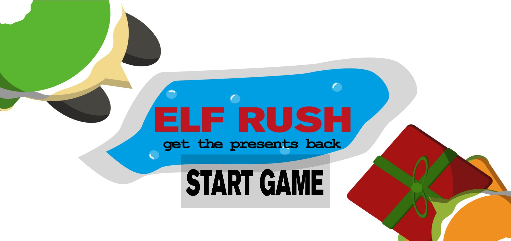
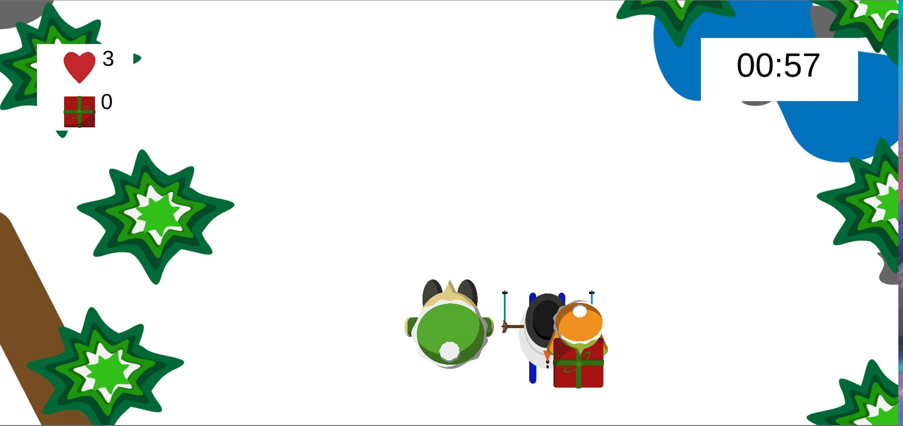
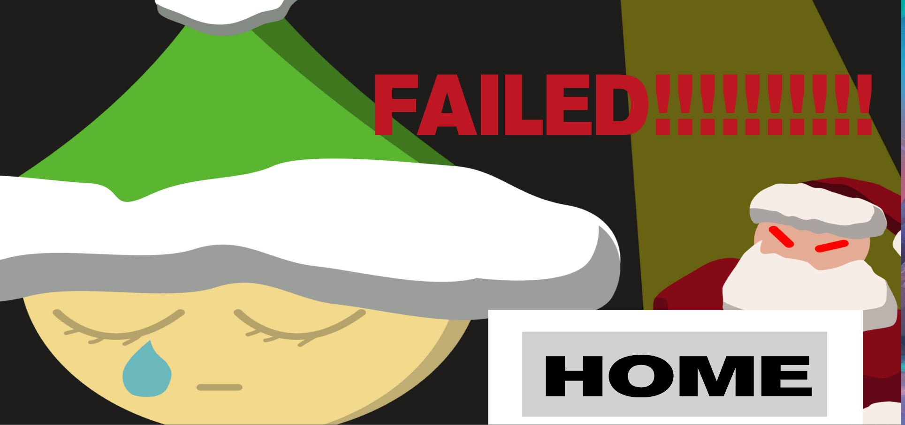

# Template2D-Unity202015f1

### Project description: 
Trolle haben dem Weihnachtsmannseine Geschenke gestohlen.Einem seiner Elfen wir befohlen die Geschenke wieder zubekommen, dies gelingt ihm,indem er die Trolle berührt, wenn er dies tut bekommt er ein Geschenkalso einen Punktbeim Scorehinzugefügt. Wenn der Elfaber einen Schneemann berührt wird ihm ein Leben abgezogen(derElfbesitzt nur 3 Leben), wenn er alle 3 leben verliert ist das Spiel zu ende. Das Ziel des Spiels ist es so viele Geschenke wie möglich in einer Minute zu sammeln.

### Development platform: 
(OS, Unity 2020 1.5f1 , Visual Studio 2019, used SDKs)
      ### Necessary setup/execution steps: 
           Strat the Unity Projekt 
      
### Target platform: 
WebGL, Ref, Res 960 x 600, screen independent

### Visuals: 
Self drawn visuals

### Third party material: 
-

### Project state: 
70%

### Limitations:
-

### Lessons Learned:

TMP Text, if statement, random spawn rate, changing scenes

Copyright by FKrispler
